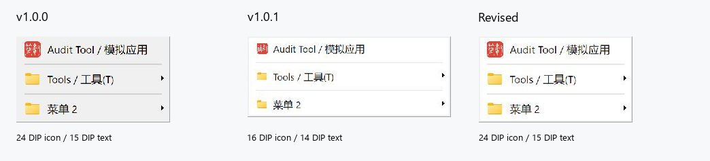

# 快捷启动菜单比例修订

状态：菜单比例修订已获发布授权，纳入 v1.0.2 发布候选。本文保留版本号升级前的截图与构建证据，不作为最终发布包校验清单。设置窗口和托盘菜单未修改。

## 结果

恢复 24 DIP 图标、15 DIP 文字、10 DIP 左边距和图文间距。行高恢复为 `max(34, 实测文字高 + 14)`，菜单按内容定宽，不再强制至少 280 DIP；单项测量宽度上限仍为 360 DIP。普通项目右边距 16，子菜单预留 28，各级菜单独立测量。保留白底和轻选中色，深色分隔线改为 `#525252`。

下图由原始菜单截图按同一显示比例并排排列，未缩放、重绘菜单内容；不是设计效果图。左：v1.0.0 渲染器，中：v1.0.1 渲染器，右：本次修订。

这组模拟数据中，主菜单原图为 226×127、299×119、226×127；第二菜单为 280×83、299×77、280×83。以上是截图工具输出像素，不是 Win32 物理窗口尺寸或设计 DIP。实际 Windows DPI 均为 144。

## 对照方法

- 源码起点 `971389faf6a57628d1c7444b150ba19699c03c56`；实际改动见工作区 diff。
- v1.0.0 渲染源码来自标签提交 `c60ff1fa41ad3589f4088d891780657370db2a23`。
- v1.0.1 渲染源码来自标签提交 `19b2ff5175a8e394017eceb7a9f72534d766ae81`。
- 两份历史 `launch_menu_renderer.cpp` 由 `git archive` 原样提取到 `build/menu-refinement/baselines/`，通过独立夹具的 `SIMPILOT_AUDIT_MENU_RENDERER` 选项编译。当前修订夹具不启用此选项，链接实际产品模块库。
- 三者都调用真实 Win32 菜单渲染实现，使用相同的当前隔离夹具、简体中文、16 项模拟数据和 144 DPI；常规夹具截图均为 868×754。历史对照不是完整旧版发布包运行证明。
- 未读取个人配置、注册全局热键、安装服务或运行菜单目标。系统文件类型图标由本机 Shell 提供，异步提取时机可能不同；不将图标内容差异归因于菜单渲染器。
- 构建输入、可执行文件和源文件的 SHA-256 见 [verification.json](verification.json) 与 `provenance-*.txt`。

## 截图索引

每个编号的 JSON 保存捕获时间、窗口、截图边界及可用的辅助功能信息。`-2` 为完整的根菜单原图，存在子菜单时 `-4` 为完整子菜单。`-0` 为宿主窗口截图：只有父子菜单均完整、绘制稳定的图用于空间关系评审；部分早期 `-0/-1/-3` 含裁切或动画过渡，仅保留溯源，不用于视觉结论。

| 编号 | 内容 | 完整原图 |
| --- | --- | --- |
| A01 | v1.0.0 主菜单，浅色 | [根菜单](native/A01-v100-main-light-2.jpg) |
| A02 | v1.0.0 第二菜单，浅色 | [根菜单](native/A02-v100-second-light-2.jpg) |
| A03 | v1.0.0 第二菜单与子菜单 | [父](native/A03-v100-second-submenu-light-2.jpg)、[子](native/A03-v100-second-submenu-light-4.jpg)、[整体](native/A03-v100-second-submenu-light-0.jpg) |
| B01 | v1.0.1 主菜单，浅色 | [根菜单](native/B01-v101-main-light-2.jpg) |
| B02 | v1.0.1 第二菜单，浅色 | [根菜单](native/B02-v101-second-light-2.jpg) |
| B03 | v1.0.1 第二菜单与子菜单 | [父](native/B03-v101-second-submenu-light-2.jpg)、[子](native/B03-v101-second-submenu-light-4.jpg)、[整体](native/B03-v101-second-submenu-light-0.jpg) |
| C01 | 修订版主菜单，浅色 | [根菜单](native/C01-current-main-light-2.jpg) |
| C02 | 修订版第二菜单，浅色 | [根菜单](native/C02-current-second-light-2.jpg) |
| C03 | Down 选中根菜单第一项 | [选中项](native/C03-current-down-first-2.jpg) |
| C04 | 修订版第二菜单与子菜单 | [父](native/C04-current-second-submenu-light-2.jpg)、[子](native/C04-current-second-submenu-light-4.jpg)、[整体](native/C04-current-second-submenu-light-0.jpg) |
| C05 | Left 关闭子菜单，父项仍选中 | [父菜单](native/C05-current-left-parent-2.jpg) |
| C06 | Right 重新展开，选中子菜单第一项 | [子菜单](native/C06-current-right-child-4.jpg) |
| C07 | Down 选中子菜单下一项 | [子菜单](native/C07-current-down-child-4.jpg) |
| C08 | Up 返回子菜单第一项 | [子菜单](native/C08-current-up-child-4.jpg) |
| C09 | Esc 收起子菜单 | [父菜单](native/C09-current-escape-child-2.jpg) |
| C10 | `d` 助记键重新展开 Documents | [子菜单](native/C10-current-mnemonic-4.jpg) |
| C11 | 再按 Esc 关闭根菜单 | [宿主](native/C11-current-escape-root-0.jpg) |
| D01 | 修订版主菜单，深色 | [根菜单](native/D01-current-main-dark-2.jpg) |
| D02 | 修订版第二菜单，深色 | [根菜单](native/D02-current-second-dark-2.jpg) |
| D03 | 修订版深色父子菜单，父项选中 | [父](native/D03-current-second-submenu-dark-2.jpg)、[子](native/D03-current-second-submenu-dark-4.jpg)、[整体](native/D03-current-second-submenu-dark-0.jpg) |
| E01 | 靠近屏幕右缘触发，根菜单向左展开 | [菜单](native/E01-current-right-edge-main-2.jpg)、[位置记录](native/E01-current-right-edge-main-0.jpg) |
| X01 | 范围外问题：键盘焦点停在自绘分隔条 | [记录](native/X01-before-fix-separator-focus-2.jpg) |

X01 文件名中的 `before-fix` 是采集时的临时名称；本轮未修复该既有问题，没有对应的修复后图片。

## 验证

- Release 产品构建成功；完整 CTest **21/21 通过**，见 [ctest.log](ctest.log)。
- 菜单专项覆盖浅/深主题、96/144/192 DPI、短名称、中英文长名称、超长名称、图标缺失、独立子菜单宽度、分隔带及助记键测量。
- `audit_preview.exe --self-test` 返回 0；夹具只操作临时模拟数据。
- 原生观察：短菜单不再留出强制大面积右侧空白，旧版图标与字号恢复；本次样本未见文字截断、图标与文字重叠或双重箭头。父子菜单宽度按各自内容变化。
- 连续操作 C05–C11 证实左右键展开/返回、子菜单上下选择、Esc 分层关闭和 Documents 助记键；没有执行任何启动目标。
- E01 证实右缘根菜单向左显示。四方向定位计算的现有单测仍通过；不能据此宣称实机全屏幕边缘测试完成。

## 保留问题与缺口

- 深色 D01/D02 的未选中系统子菜单箭头对比度较低，选中时可见。箭头仍由 Windows 绘制，本轮未添加自绘箭头或更改主题机制，需要独立兼容性修复。
- X01 可见键盘选择落在自绘分隔条上。现有实现为普通 owner-draw 项而非系统 separator，本次没有修改注册/键盘语义，不能将根菜单跨分隔线导航标为通过。
- 自动化过程中少量窗口激活使菜单关闭；右缘子菜单验证时夹具恢复为非最大化状态，该次不计通过。未实测底边翻转、多显示器迁移和多层嵌套全部路径。
- 实际 100%/200% DPI、高对比度尚未截图验收；测量单测不是实机渲染证明。超长名称省略及无图标布局已做测量测试，但本次正常数据截图不覆盖这两种极端原生状态。
- 截图采集阶段未修改版本号或发布；后续获授权纳入 v1.0.2。最终包以发布流水线及随包 SHA-256 为准。以上兼容性问题不因发布或测试通过而被视作解决。

## 本地查看

修订版产品：`build/ci-vs2022-x64/Release/Simpilot.exe`。

安全预览：`build/menu-refinement/current/Release/audit_preview.exe`，点击 `Menu theme: light/dark`，再打开 `Main launch menu` 或 `Second launch menu`。预览不运行启动目标。三组构建的 `input-provenance.txt` 也保留在各自构建目录。
